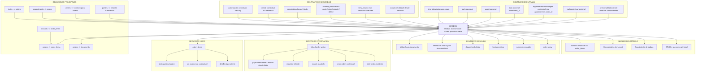

```mermaid
flowchart TB

    O[ORDERS\nMódulo autónomo de núcleo operativo fuerte]

    subgraph N["NÚCLEO DEL MÓDULO"]
        O1[CRUD y operación principal]
        O2[Seguimiento de trabajo]
        O3[Hub operativo del tenant]
        O4[Gestión de detalle vía order_items]
    end

    subgraph E["CONTRATO DE ENTRADA"]
        E1[kind obligatorio para create]
        E2[party opcional]
        E3[asset opcional]
        E4[task opcional\norders.task_id]
        E5[appointment como origen contextual real\nappointments.order_id]
        E6[trail contextual opcional]
        E7[precompletado desde módulos consumidores]
    end

    subgraph S["CONTRATO DE SEGURIDAD"]
        S1[Autorización central por Security]
        S2[create contextual\nNO abstracto]
        S3[constraints.allowed_kinds]
        S4[allowed_kinds arbitra\ncreate / view / update / delete]
        S5[view_any no más restrictivo que view]
        S6[scope del dataset desde backend]
    end

    subgraph X["CONTRATO DE SALIDA"]
        X1[order show]
        X2[summary reusable]
        X3[lookup mínimo]
        X4[dataset embebible]
        X5[referencia central para otros módulos]
        X6[bridge hacia documents]
    end

    subgraph I["OFERTA DE INTEGRACIÓN"]
        I1[linked-order-action]
        I2[abrir orden existente]
        I3[crear orden contextual]
        I4[estado readonly]
        I5[requisito faltante]
        I6[payload backend + bloque visual oficial]
    end

    subgraph H["RECURSOS HIJOS"]
        H1[order_items]
        H2[detalle dependiente]
        H3[sin autonomía contractual]
        H4[delegación al padre]
    end

    subgraph R["RELACIONES PRINCIPALES"]
        R1[tasks --> orders]
        R2[appointments --> orders]
        R3[orders --> documents]
        R4[orders --> order_items]
        R5[products --> order_items]
        R6[assets --> contexto para orders]
        R7[parties --> relación transversal]
    end

    O --> O1
    O --> O2
    O --> O3
    O --> O4

    E1 --> O
    E2 --> O
    E3 --> O
    E4 --> O
    E5 --> O
    E6 --> O
    E7 --> O

    O --> X1
    O --> X2
    O --> X3
    O --> X4
    O --> X5
    O --> X6

    S1 --> O
    S2 --> O
    S3 --> O
    S4 --> O
    S5 --> O
    S6 --> O

    O --> I1
    I1 --> I2
    I1 --> I3
    I1 --> I4
    I1 --> I5
    I1 --> I6

    O --> H1
    H1 --> H2
    H1 --> H3
    H1 --> H4

    R1 --> O
    R2 --> O
    O --> R3
    O --> R4
    R5 --> R4
    R6 --> O
    R7 --> O

```
